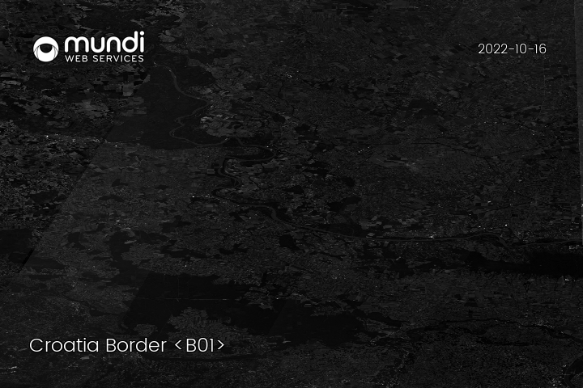
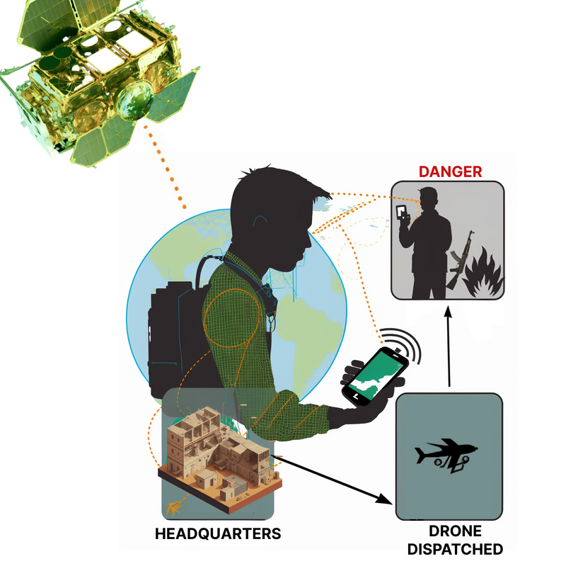
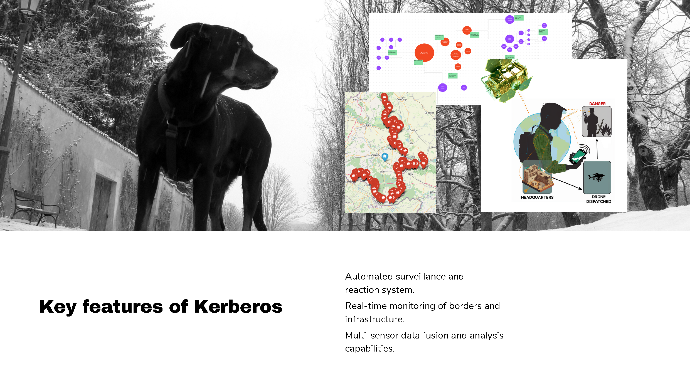
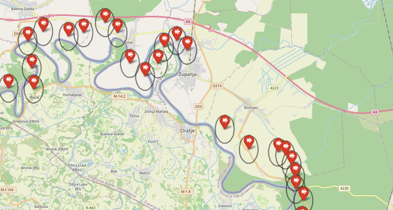

README.md

# Cassini Hackathon 5th edition

Repository provides the geo-spatial analysis prepared for the purpose of __[CASSINI Hackathons - $5^{th} edition$: Space for Defence &amp; Security](https://taikai.network/cassinihackathons/hackathons/defence-security)__.

## Kerberos

A platform utilizing satellite data to connect with a fleet of drones, while facilitating user and sensor input. Fore detailed information, please visit [TAIKAI page](https://taikai.network/cassinihackathons/hackathons/defence-security/projects/clfce3bgf84242801x2lltfw0ky/idea).

### Concept

### Key features

#### Drone Network Proposal

